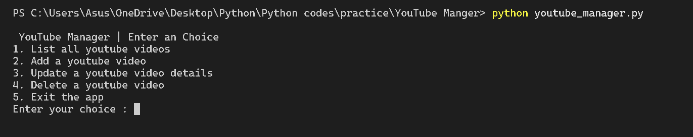
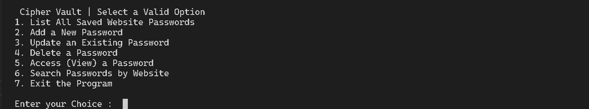
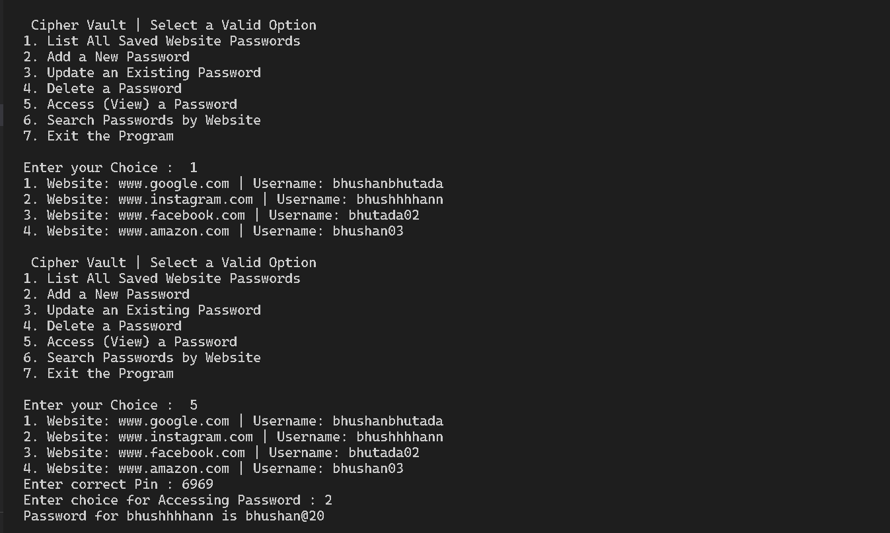

# Cipher Vault — Python CLI Password Manager

## Overview

Cipher Vault is a command-line password manager built using Python.

The project evolved from a basic file-based system to a database-backed application. It allows users to securely store and manage credentials using encryption, with support for CRUD operations and search functionality.

Passwords are never stored in plain text and require a PIN for access.

---

## Project Evolution

This project has two versions:

### 1. JSON Version (Basic)

* Stores data in a local file
* Uses JSON for persistence
* Demonstrates file handling and basic encryption

### 2. MySQL Version (Upgraded)

* Uses MySQL database for storage
* Implements CRUD operations using SQL
* Adds search functionality
* Improved structure and real-world relevance

---

## Key Features

* Add, update, delete, and view credentials
* Encrypted password storage (XOR-based)
* PIN-based password access
* Search credentials by website
* Menu-driven CLI interface
* Database integration (MySQL version)

---

## Technology Stack

* Language: Python
* Database: MySQL (for upgraded version)
* Storage (basic version): JSON
* Interface: Command-Line Interface (CLI)

---

## Project Structure

```
cipher-vault/
│
├── json-version/
│   ├── main.py
│   └── password_manager.txt
│
├── mysql-version/
│   ├── main.py
│   ├── db.py
│
├── images/
│   ├── json/
│   ├── mysql/
│
└── README.md
```

---

## Setup Instructions (MySQL Version)

### 1. Install MySQL

### 2. Create Database

```
CREATE DATABASE cipher_vault;
```

### 3. Create Table

```
CREATE TABLE credentials (
    id INT AUTO_INCREMENT PRIMARY KEY,
    website VARCHAR(255),
    username VARCHAR(255),
    password TEXT
);
```

### 4. Update Database Credentials

Update `db.py`:

```
host="localhost",
user="root",
password="your_password",
database="cipher_vault"
```

### 5. Run the Application

```
python main.py
```

---

## Demo Screenshots

### JSON Version

Main Menu:



Accessing Password:


---

### MySQL Version

Main Menu:



Database View:


Accessing Password:



---

## Encryption Approach

This project uses a basic XOR-based reversible encryption method.

```
encrypted = ord(char) ^ key
decrypted = chr(encrypted ^ key)
```

Passwords are stored in encrypted form and converted using JSON for database compatibility.

Note: This method is for learning purposes and not suitable for production use.

---

## Learning Outcomes

* CLI-based application development
* File handling and JSON processing
* Database integration with MySQL
* CRUD operations using SQL
* Basic encryption techniques
* Code modularization and structure improvement

---

## Future Improvements

* Strong encryption (Fernet)
* User authentication system
* Web-based interface using Flask

---

## Author

Bhushan Bhutada
Computer Engineering Student
