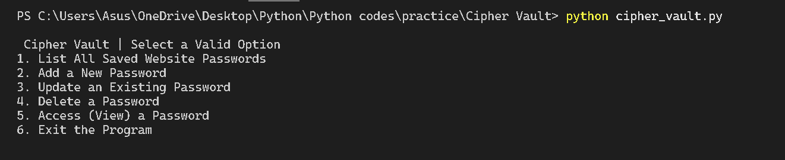
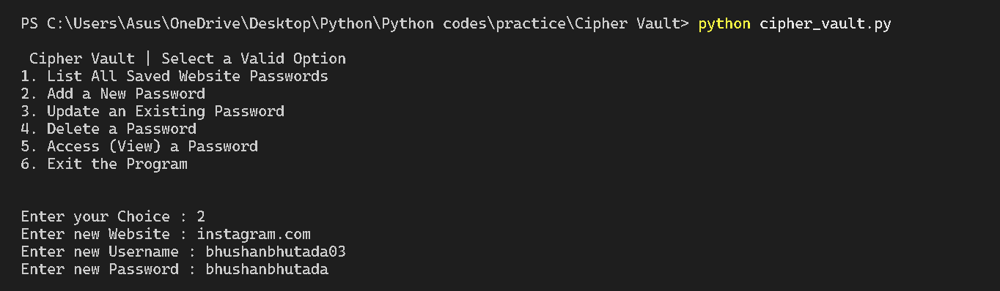

# Cipher Vault — Python CLI Password Manager

## Overview
Cipher Vault is a command-line password management tool developed using Python.  
The application allows users to securely store and manage credentials for multiple websites using a lightweight XOR-based encryption mechanism.

Passwords are never stored in plain text. Instead, they are encrypted before being written to persistent storage and can only be decrypted using a user-provided PIN.

This project demonstrates concepts such as command-line application design, basic cryptographic logic, file-based data persistence, and modular program structure.

---

## Key Features

- Secure storage of website credentials
- XOR-based reversible encryption for password protection
- Add, update, delete, and retrieve stored credentials
- PIN-based authentication for password decryption
- Persistent storage using JSON file handling
- Menu-driven command-line interface
- Automatic file creation for first-time execution

---

## Technology Stack

- Language: Python
- Data Storage: JSON file
- Interface: Command-Line Interface (CLI)

---

## Encryption Approach

Cipher Vault implements a lightweight reversible XOR encryption technique.

Encryption logic:

```python
encrypted_value = ord(character) ^ key
original_character = chr(encrypted_value ^ key)
```

Each character of the password is converted to an encrypted integer value before being stored.

A PIN is required to decrypt and display the original password, ensuring that stored credentials cannot be directly read from the storage file.

Note: This encryption method is implemented for educational purposes to demonstrate fundamental cryptographic concepts.

---

## Project Structure

```
cipher-vault/
│
├── cipher_vault.py        # Main application logic
├── password_manager.txt   # JSON file storing encrypted credentials
└── README.md              # Project documentation
```

---

## Running the Application

### Requirements
Python 3.x installed

### Steps

Clone the repository:

```
git clone https://github.com/bhushanbhutada03/cipher-vault.git
```

Navigate to the project directory:

```
cd cipher-vault
```

Run the program:

```
python cipher_vault.py
```

---

## Application Menu

The program provides the following operations:

1. List all saved website credentials  
2. Add a new credential  
3. Update an existing credential  
4. Delete stored credential  
5. View decrypted password (PIN required)  
6. Exit the program

---

## Demo Screenshots

### Main Menu

Below is the main command-line interface of the application:



### Accessing a Saved Password

Example of retrieving stored credentials using the PIN:



---

## Example Program Output

```
===== Cipher Vault =====

1. List saved passwords
2. Add new password
3. Update existing password
4. Delete password
5. Access password
6. Exit

Enter choice: 1

Saved Websites:
1. google.com
2. github.com
```

Accessing a password:

```
Enter website name: google.com
Enter PIN: ****

Username: bhushan
Password: mysecurepassword
```

---

## Example Stored Data

Example JSON entry in `password_manager.txt`:

```json
[
  {
    "website": "google.com",
    "username": "bhushan",
    "password": [171, 85, 90]
  }
]
```

Passwords are stored as encrypted integer arrays rather than plain text values.

---

## Learning Outcomes

This project demonstrates practical understanding of:

- CLI-based application development
- File handling and JSON data management
- Basic encryption techniques
- Modular Python program design
- Data persistence in local storage

---

## Author

Bhushan Bhutada  
Computer Science Engineering Student

---

## Future Improvements

Potential enhancements include:

- Stronger encryption mechanisms
- Master password authentication
- Database-backed credential storage
- Graphical user interface (GUI)
