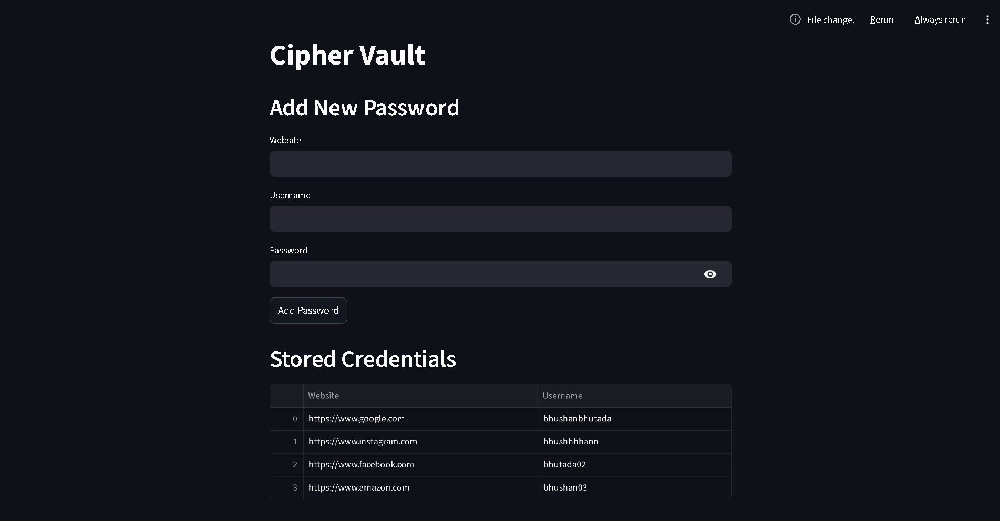
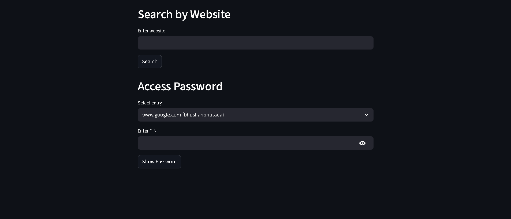

# Cipher Vault — Python CLI Password Manager

## Overview

Cipher Vault is a password manager built using Python.

The project evolved from a basic file-based system to a database-backed application with a web interface. It allows users to securely store and manage credentials using encryption, with support for CRUD operations and search functionality.

Passwords are never stored in plain text and require a PIN for access.
 
---

## Project Evolution

This project has two versions:

### 1. JSON Version (Basic)

* Stores data in a local file
* Uses JSON for persistence
* Demonstrates file handling and basic encryption

### 2. MySQL Version (Upgraded)

* Uses MySQL database for storage
* Implements CRUD operations using SQL
* Adds search functionality
* Includes a Streamlit-based web interface
* Improved structure and real-world relevance

---

## Key Features

* Add, update, delete, and view credentials
* Encrypted password storage (XOR-based)
* PIN-based password access
* Search credentials by website
* Menu-driven CLI interface
* Database integration using MySQL
* Web-based interface using Streamlit

---

## Technology Stack

* Language: Python
* Database: MySQL
* Storage (basic version): JSON
* Interface: CLI and Streamlit (Web UI)

---

## Project Structure

```
cipher-vault/
│
├── json-version/
│   ├── main.py
│   └── password_manager.txt
│
├── mysql-version/
│   ├── main.py
│   ├── db.py
│   ├── app.py
│   ├── requirements.txt
│
├── images/
│   ├── json/
│   ├── mysql/
│
└── README.md
```

---

## Setup Instructions (MySQL Version)

### 1. Install MySQL

### 2. Create Database

```
CREATE DATABASE cipher_vault;
```

### 3. Create Table

```
CREATE TABLE credentials (
    id INT AUTO_INCREMENT PRIMARY KEY,
    website VARCHAR(255),
    username VARCHAR(255),
    password TEXT
);
```

### 4. Update Database Credentials

Update `db.py` with your local configuration:

```
host="localhost",
user="root",
password="your_password",
database="cipher_vault"
```

---

## Running the Application

### CLI Version

```
python main.py
```

---

### Streamlit Web App

Navigate to the MySQL version:

```
cd mysql-version
```

Install dependencies:

```
pip install -r requirements.txt
```

Run the application:

```
streamlit run app.py
```

Open in browser:

```
http://localhost:8501
```

---

## Demo Screenshots

### JSON Version

Main Menu:


Accessing Password:


---

### MySQL Version (CLI)

Main Menu:


Database View:


Accessing Password:


---

### Streamlit Web UI

Interface:



Access Password:



---

## Encryption Approach

This project uses a basic XOR-based reversible encryption method.

```
encrypted = ord(char) ^ key
decrypted = chr(encrypted ^ key)
```

Passwords are stored in encrypted form and converted using JSON for database compatibility.

> Note: This method is implemented for learning purposes and is not suitable for production use.

---

## Learning Outcomes

* CLI-based application development
* File handling and JSON processing
* Database integration with MySQL
* CRUD operations using SQL
* Basic encryption techniques
* Building a simple web interface using Streamlit
* Code modularization and structure improvement

---

## Future Improvements

* Strong encryption (Fernet)
* User authentication system
* Enhanced UI using Flask or modern frontend frameworks

---

## Author

Bhushan Bhutada
Computer Engineering Student
